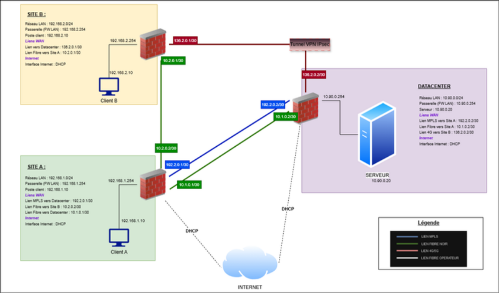

# TELREDOR — Refonte d'une architecture WAN multi-sites

> Conception et validation par POC d'une **architecture WAN unifiée, sécurisée et QoS** interconnectant des sites hétérogènes (MPLS, fibre noire, 4G) à moindre coût, avec **SD-WAN** pour l'orchestration, **VPN IPsec** pour les sites non couverts, et **défense en profondeur** par pare-feu UTM.

**Projet académique — CESI École d'Ingénieurs (La Rochelle) · Cycle ingénieur — Élective Réseaux, Télécom & Sécurité · 2026**

---

## Contexte

**Telredor** est une entreprise familiale devenue une multinationale par **rachats successifs de concurrents**, en collaboration avec son partenaire historique Supra Telecom. Chaque entité absorbée ayant conservé ses propres choix techniques, l'infrastructure du système d'information est devenue, au fil des acquisitions, **fortement hétérogène et difficile à administrer**.

L'analyse de l'existant fait ressortir six constats majeurs :

| Domaine | Constat initial |
|---|---|
| **Cartographie** | Schémas d'infrastructure obsolètes ou incomplets |
| **Liaisons intersites** | Technologies hétérogènes (MPLS, fibre, ADSL, 4G) |
| **Routage** | 4 protocoles différents cohabitent : statique, OSPF, EIGRP, RIPv2 |
| **Services** | Doublons entre sites, sans synchronisation |
| **QoS** | Aucune politique de gestion de la qualité de service |
| **Sécurité** | Mécanismes activés de façon inégale d'un site à l'autre |

Face à ce constat, la direction a décidé de remettre à plat l'architecture globale. La démarche retenue est prudente : **valider d'abord les choix techniques sur un POC** interconnectant 2 à 3 sites pilotes, puis **généraliser progressivement** la solution à l'ensemble des sites.

## Problématique

> Comment concevoir et déployer une architecture WAN **unifiée, sécurisée** et garantissant la **qualité de service**, qui interconnecte des sites hétérogènes — avec ou sans MPLS — **à moindre coût**, tout en assurant la **redondance des sites sensibles** et l'**hébergement centralisé des services** ?

## Objectifs

- **Unifier** un WAN hérité de multiples acquisitions (3 technologies, 4 protocoles de routage).
- **Différencier** les services (voix temps réel vs flux web) via des règles SLA fines.
- **Sécuriser** les échanges par défense en profondeur (chiffrement, IDS/IPS, filtrage L7).
- **Garantir la disponibilité** des sites sensibles par redondance active.
- **Réduire les coûts** en remplaçant certains liens MPLS par du SD-WAN sur Internet.
- **Valider** l'ensemble par une maquette fonctionnelle avant généralisation.

---

## Architecture cible

Le POC interconnecte **3 entités hétérogènes** unifiées par une couche SD-WAN et sécurisées par des pare-feu UTM Stormshield sur chaque site.

| Site maquette | Rôle Telredor | Raccordement |
|---|---|---|
| **Datacenter** | Direction Générale, services centralisés | MPLS + fibre noire + Internet (redondé) |
| **Site A** | Site bien raccordé | MPLS + fibre noire + Internet |
| **Site B** | Bureau de proximité (sans MPLS) | 4G + tunnel VPN IPsec |

**Plan d'adressage** : chaque liaison inter-site utilise un sous-réseau `/30` dédié. Le site B ne dispose pas d'accès Internet direct — ses flux web transitent par le site A ou par le Datacenter selon les décisions du SD-WAN.

---

## Choix technologiques

### 1. Cœur MPLS (L3VPN)

Le **MPLS** demeure la technologie de référence pour interconnecter des sites avec une qualité garantie par SLA opérateur. Plutôt que de router chaque paquet, le MPLS **commute sur base d'étiquettes** (labels), permettant à l'opérateur d'établir des chemins maîtrisés (LSP).

**Protocoles mis en œuvre**
- **IGP du cœur** (OSPF ou IS-IS) — connectivité interne entre PE et P
- **LDP** — distribution des labels MPLS entre les routeurs
- **MP-BGP** — transport des routes clients dans la famille VPNv4
- **VRF** — table de routage virtuelle isolant totalement les routes de Telredor des autres clients (L3VPN)

**Traitement de l'hétérogénéité — Redistribution des IGP**

C'est par la **redistribution de routes** que l'architecture résout le problème d'hétérogénéité hérité des acquisitions. Chaque site conserve son protocole interne (statique à la DG, OSPF à l'usine, EIGRP à l'unité de stockage, RIPv2 à l'agence commerciale) : le PE apprend les routes du site, les redistribue dans MP-BGP au sein de la VRF, et réciproquement. **MP-BGP joue le rôle de langue commune** à travers le WAN.

### 2. Couche SD-WAN

Le **SD-WAN** est une couche logicielle de pilotage qui s'appuie sur l'ensemble des liens disponibles (MPLS, fibre noire, Internet, 4G) et **sélectionne dynamiquement le meilleur chemin** pour chaque flux selon les seuils SLA définis.

Le SD-WAN est **porté par les pare-feu UTM Stormshield** de chaque site. Mise en œuvre en 4 étapes :

1. Création des **objets passerelles** représentant les extrémités distantes de chaque lien
2. Création des **objets routeurs SD-WAN** regroupant les passerelles et définissant les seuils SLA
3. Création des **règles PBR** (Policy-Based Routing) associant chaque type de flux à son routeur SD-WAN
4. Supervision via le tableau de bord SD-WAN (latence, gigue, perte, disponibilité)

**Seuils SLA retenus**

| Métrique | Générique | VoIP |
|---|---|---|
| **Latence** | 50 ms | 30 ms |
| **Gigue** | 30 ms | 30 ms |
| **Perte de paquets** | < 1 % | < 1 % |
| **Indisponibilité** | < 1 % | < 1 % |

Cette granularité par application permet de diriger la **VoIP en priorité sur la fibre noire** (lien le plus stable) avec le MPLS en secours, tandis que les **flux web privilégient le MPLS ou l'accès Internet local**.

### 3. VPN IPsec pour sites sans MPLS

Le nuage MPLS n'étant pas disponible sur tous les sites (bureaux de proximité, représentés par le **Site B**), ces sites sont raccordés par des **tunnels VPN IPsec site à site** établis sur des liens Internet ou 4G.

**Choix techniques**

- **IKEv2** retenu (plus rapide, plus stable, plus sécurisé qu'IKEv1)
- **Authentification PSK** dans le cadre du POC (PKI à certificats envisageable en généralisation)
- **Interfaces VTI** (Virtual Tunnel Interface) : `172.25.255.1/30` ↔ `172.25.255.2/30`
- Les VTI rendent le tunnel **supervisable par le SD-WAN** — intégration transparente au routage dynamique
- **Keep-alive activé** pour maintien automatique du tunnel

---

## Redondance et haute disponibilité

La disponibilité des sites sensibles repose sur la combinaison de plusieurs mécanismes complémentaires :

- **Multiplicité des liens WAN** : le Datacenter est joignable depuis le Site A par MPLS **et** fibre noire, et depuis le Site B par VPN 4G avec secours par la fibre via le Site A.
- **Bascule automatique SD-WAN** : supervision par sonde toutes les **2 secondes**, bascule après échec en **4 à 6 secondes** — transparente pour l'utilisateur (validé en maquette par simulation de coupures).
- **Redondance des sorties Internet** : flux web pouvant sortir par l'accès local du Site A ou, en secours, par celui du Datacenter — défaillance détectée par sonde TCP (`dns_tcp`).

---

## Sécurité — Défense en profondeur

L'approche de sécurité **ne se limite pas au filtrage périmétrique** : elle est organisée en 4 couches complémentaires.

### Chiffrement des flux inter-sites
Les flux empruntant des réseaux non maîtrisés (Internet, 4G) sont **systématiquement chiffrés par les tunnels VPN IPsec**.

### Détection et prévention d'intrusion (IDS/IPS)
Les pare-feu intègrent un moteur d'inspection fonctionnant en deux modes :
- **IDS** — détection : flux suspect journalisé et alarme levée, trafic autorisé
- **IPS** — prévention : flux non conforme bloqué

**Cas concret documenté** : l'alarme *Invalid RTP payload type* levée par les flux VoIP légitimes a été analysée puis traitée par un **profil d'inspection dédié (`ips_03`)** — illustration de la **qualification des faux positifs**, préférable à la désactivation globale d'une protection.

### Filtrage applicatif (niveau 7)
Au-delà du filtrage par port (facilement détournable), le pare-feu **inspecte le contenu réel** des échanges. Exemple maquette : un profil FTP dédié (`ftp_02` avec `ips_02` en mode IPS) restreint l'accès au serveur FTP du Datacenter **au seul utilisateur autorisé** — toute connexion avec un autre compte est coupée dès la phase d'authentification (`connection closed`).

### Filtrage web et inspection SSL
Politique d'inspection SSL avec **page de blocage du pare-feu** en cas de tentative d'accès non autorisée, dans le respect des contraintes CNIL.

---

## Qualité de service (QoS)

La QoS s'apprécie selon **4 critères** : latence, gigue, perte de paquets, disponibilité. Les applications temps réel comme la VoIP y sont particulièrement sensibles (**latence cible < 30 ms**).

Le **SD-WAN constitue le premier mécanisme de différenciation de service** :
- Seuils SLA définis par type de flux
- Routage par application
- La **voix** emprunte en permanence le lien le plus stable (fibre noire prioritaire, MPLS en secours)
- Les flux moins sensibles utilisent les autres chemins

Un lien qui ne respecte plus les seuils est immédiatement écarté au profit d'un chemin conforme.

---

## Maquette fonctionnelle et validation

**Plateforme technique**
- Virtualisation **Proxmox**
- Pare-feu **Stormshield EVA** (VM)
- Postes clients Linux
- Serveur Linux hébergeant les services

**Services déployés sur le Datacenter**
- **Asterisk** (téléphonie IP) testé avec le client **Zoiper**
- **Apache** (serveur web)
- **FTP** avec authentification
- **SSH**

### Scénario de validation — 9 actes démontrés

| Acte | Sujet | Durée |
|---|---|---|
| 0 | Vue d'ensemble de l'architecture | 1 min |
| 1 | Connectivité multi-site & SD-WAN | 2 min |
| 2 | Différenciation de service / QoS (VoIP) | 2 min |
| 3 | Redondance & bascule de lien (coupure → reprise en ~5-6 s) | 2 min |
| 4 | Interconnexion d'un site sans MPLS via VPN IPsec | 1,5 min |
| 5 | Sécurité — Détection d'intrusion (IDS/IPS) | 1,5 min |
| 6 | Sécurité — Filtrage applicatif (FTP L7) | 1,5 min |
| 7 | Sécurité — Filtrage web / Inspection SSL | 1 min |
| 8 | Services centralisés (VoIP, Web) | 1,5 min |
| 9 | Accès nomade (VPN client-à-site) | 1 min |

---

## Planning de déploiement

Le déploiement suit une **démarche en 4 phases** avec un jalon de validation entre chaque, afin d'éviter les évolutions faites à la hâte constatées par le passé. La généralisation (phase 4) s'effectue site par site, chaque site bénéficiant des **modèles de configuration validés sur le POC** (profils Stormshield, objets SD-WAN, gabarits de tunnels VPN).

---

## Étude financière (synthèse)

Sur la base des hypothèses retenues (5 sites, conservation du MPLS sur 2 sites, généralisation des accès Internet pilotés par SD-WAN, administration centralisée) :

- **Retour sur investissement** de l'ordre d'**un an**
- Gains principaux : **réduction du nombre de liens MPLS onéreux**, centralisation de l'administration, mutualisation des services
- Surcoût assumé : maintenance de la sécurité (UTM) — indispensable au niveau d'exigence

---

## Perspectives

Au-delà du périmètre validé par le POC, les évolutions planifiées incluent :

- **Services d'entreprise** : Exchange Server 2019 (messagerie), MDM (mobile), Active Directory (Windows Server 2022)
- **Accès nomade** : VPN client-à-site pour utilisateurs en mobilité
- **QoS de bout en bout** : marquage DSCP et files d'attente sur équipements Cisco
- **Supervision centralisée & SIEM** : centralisation des journaux, corrélation d'événements
- **Renforcement cybersécurité** : MFA, démarche Zero Trust, automatisation des réponses
- **Généralisation SD-WAN** à l'ensemble des sites Telredor

---

## Apports du projet

- **Unification** d'un WAN hétérogène (3 technologies de transport, 4 protocoles de routage à l'origine).
- Démonstration concrète de la **résilience** des sites sensibles (bascule 4-6 s validée en direct).
- **Réduction du coût** du WAN via l'orchestration SD-WAN + Internet, tout en conservant le MPLS là où sa valeur SLA le justifie.
- **Sécurité applicative et proactive** (IDS/IPS, filtrage L7), pas seulement périmétrique.
- **POC reproductible** avec modèles de configuration prêts pour la généralisation.

## Stack technique

`Proxmox` · `Stormshield UTM (EVA)` · `MPLS L3VPN` · `MP-BGP` · `LDP` · `VRF` · `OSPF` · `EIGRP` · `SD-WAN` · `VPN IPsec IKEv2` · `VTI` · `Asterisk (VoIP)` · `Apache` · `IDS/IPS` · `Filtrage L7` · `Inspection SSL` · `QoS`

---

## Livrables du projet

- 📄 **Rapport de conception WAN** — architecture détaillée, choix techniques justifiés, étude financière
- 🖥️ **Maquette POC** — 3 sites virtualisés sous Proxmox, entièrement fonctionnelle
- 🎤 **Soutenance** — présentation + démonstration en 9 actes devant jury

## Note

Projet mené dans le cadre de l'élective **Réseaux, Télécom & Sécurité** du cycle ingénieur CESI, avec restitution et démonstration en direct devant jury.

**Réalisé en binôme avec [Etienne TETSSOP](https://github.com/) — projet initialement dimensionné pour trois, mené à deux, ce qui a permis de couvrir l'ensemble des volets (WAN, sécurité, services).**

*Auteur : Sylvère ELAT — Étudiant ingénieur Systèmes, Réseaux & Cybersécurité (CESI La Rochelle)*
